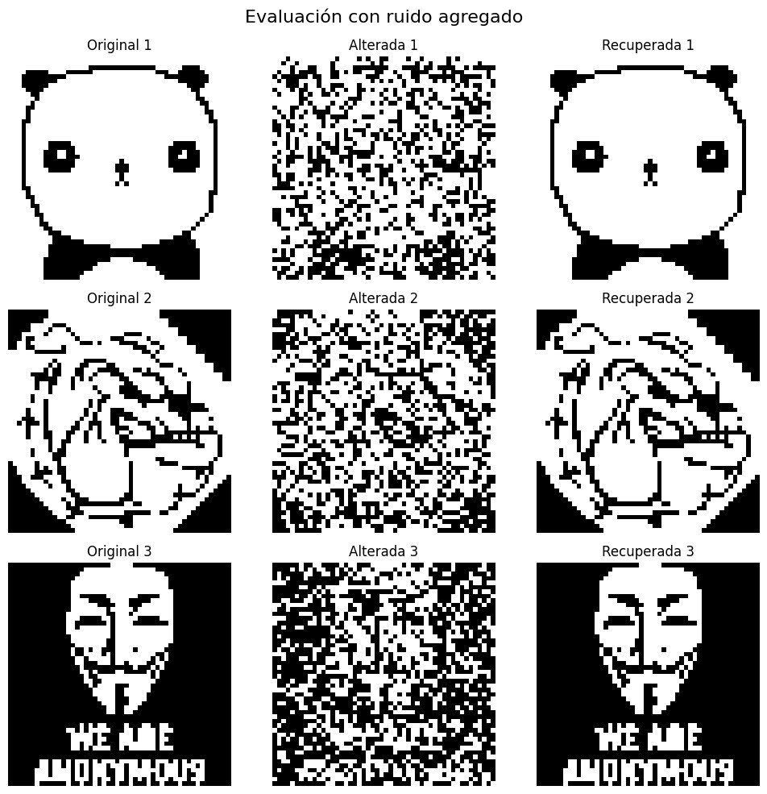
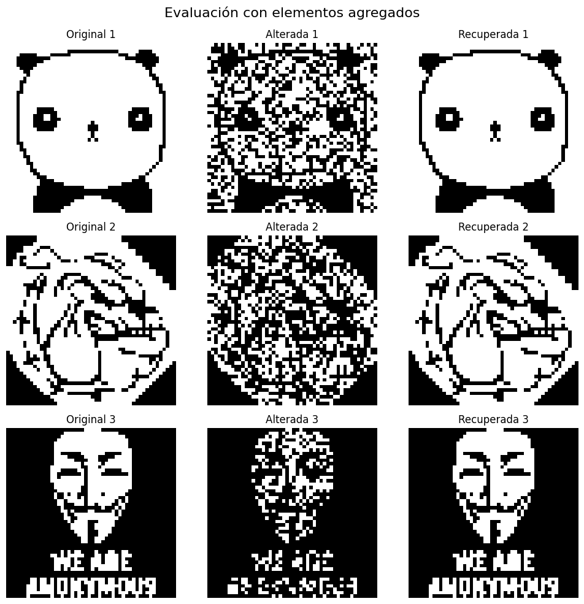

# Hopfield Network

Hopfield networks are a type of recurrent neural network, known for their ability to act as **associative memories**. Through these networks, it is possible to recover previously learned patterns, even when incomplete or noisy versions are presented.

The functioning of a Hopfield network is based on the energy of the system's states. The goal is for the network to evolve toward a **minimum energy** state, allowing it to recover the closest pattern to the one presented. The update rule follows a criterion to minimize the system's overall energy.

## Image Alteration and Noise

In this experiment, a Hopfield network was trained with binary images, and then its ability to recall these images when altered versions were presented was evaluated. The images were altered in several ways:

1. **Noise**: Random pixel values were inverted by 30%.
   
   
   
2. **Element removal**: Random pixels were set to white (1), also by 30%.
   
   
   
3. **Element addition**: Dark elements (-1) were added to the images by 40%.
   
   

Despite these alterations, the Hopfield network was able to **correctly recover the patterns in most cases**.

  
Spurious States

  One of the characteristics of Hopfield networks is the appearance of **spurious states**. These are stable states where the network can fall into, but they do not correspond to any of the learned patterns. They can be inverted patterns or combinations of several learned patterns, causing the network to not always converge to the correct pattern.

  Spurious states can be:
  - **Inverted patterns**: The original pattern with all elements flipped.
  - **Combinations of patterns**: A superposition of several learned patterns.

  
  
  **Figure 2.2**: Examples of spurious states generated by combining three learned patterns.

  
Network Capacity

  The capacity of a Hopfield network refers to how many patterns it can effectively store and recall. During the experiments, it was observed how this capacity changes due to factors such as the correlation between patterns or when synapses are randomly removed. As synapses are removed, the capacity decreases, as the network loses crucial information about the connections that allow pattern retrieval.

  When synapses are removed, the error increases, but even with a large percentage of removed connections, the network continues to operate with minimal error:

  

  Additionally, the capacity changes as follows:
  
  

  
Ising Model

  The **Ising Model** is a model from statistical physics that was proposed to explain the phenomena of magnetization in ferromagnetic materials. In the context of neural networks, it is relevant for understanding how systems with many units can exhibit **collective behavior**.

  ### Why does the Ising Model arise?

  This model is used to study the interaction between atoms with **spins** (or magnetic moments) that can only have two possible states: **up (+1)** or **down (-1)**. Each atom is influenced by its neighbors, and the system seeks configurations that minimize the total energy of the ensemble, similar to how Hopfield networks attempt to converge to a minimum energy state.

  The **energy of the system** is calculated by considering the interactions between pairs of neighboring spins. If two spins are aligned (both +1 or both -1), they contribute to lowering the system's energy. If they are in opposite directions, the system's energy increases.

  ### Magnetization and the importance of the model

  **Magnetization** measures how many spins are aligned in the same direction. In ferromagnetic materials, below a certain temperature called the **critical temperature** or **Curie temperature**, the spins tend to align, producing a net magnetization. Above this temperature, the system loses alignment, and on average, there is no magnetization.

  In one dimension (1D), there is no spontaneous magnetization at finite temperatures. This is because, in the 1D model, thermal fluctuations are strong enough to disorder the spins, even at low temperatures, preventing the formation of net magnetization. This contrasts with systems in two or more dimensions, where a phase transition allows for net magnetization below the critical temperature.

  
  
  **Figure 3.1**: Magnetization as a function of temperature in the Ising Model.

  ### Importance of the model

  The **Ising Model** is crucial for understanding **phase transitions**, such as the change between a magnetic and non-magnetic state in materials. These concepts are also applicable to recurrent neural networks, where low-energy states correspond to memorized patterns. Like the Ising model, neural networks must balance energy and interactions between nodes.

## Conclusions

The Hopfield network is effective at recovering patterns with a certain level of noise or alteration, but it suffers from the appearance of spurious states that can compromise correct retrieval. Additionally, the storage capacity depends greatly on the integrity of synaptic connections, and the removal of synapses negatively impacts its performance.

---

This development and more can be found in the file [`hopfieldNetwork.ipynb`](../hopfieldNetwork.ipynb), where other practical examples are also analyzed:
- How the network responds to unlearned patterns.
- The influence of the number of stored patterns on the network's capacity.
- Simulated Annealing.
