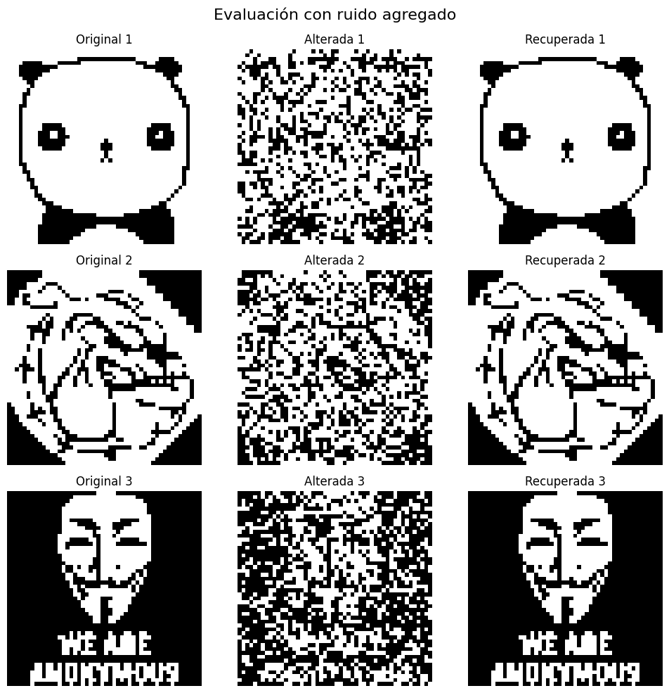
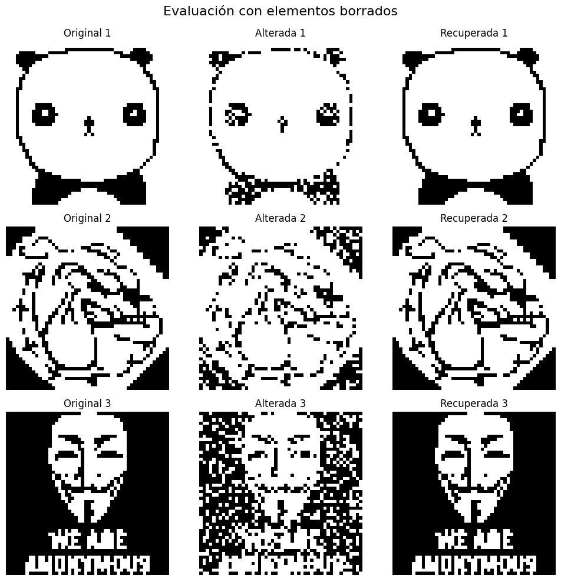
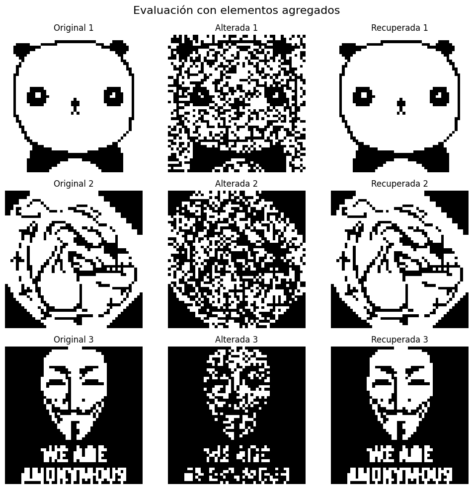
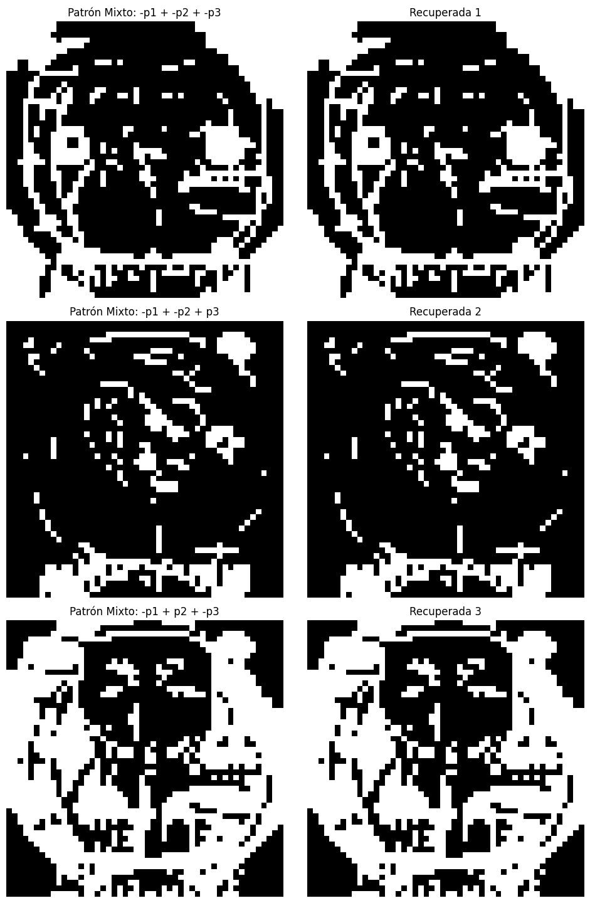
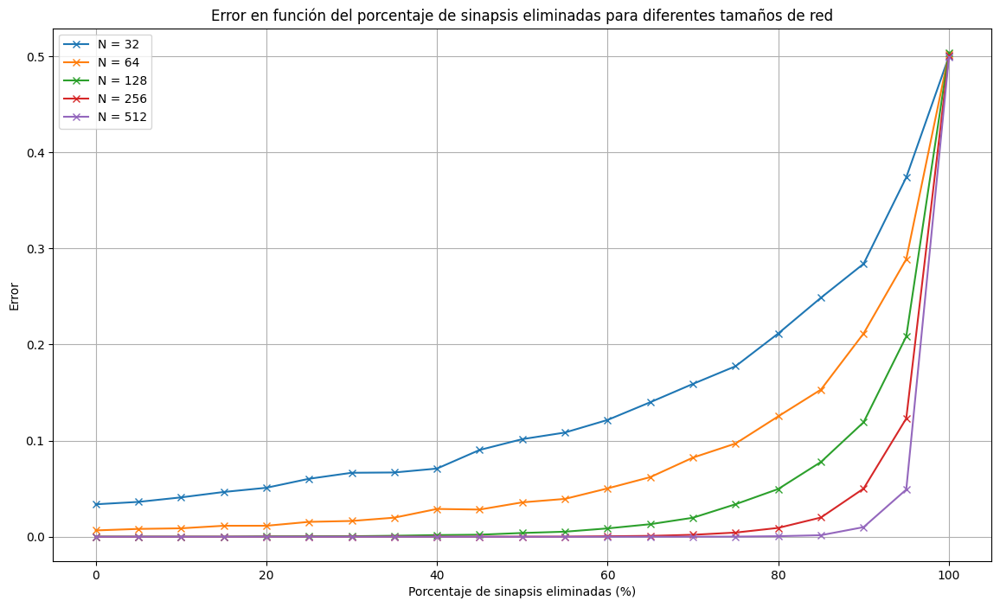
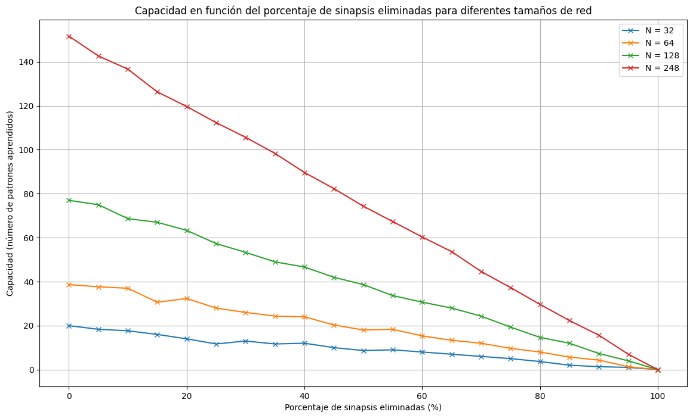
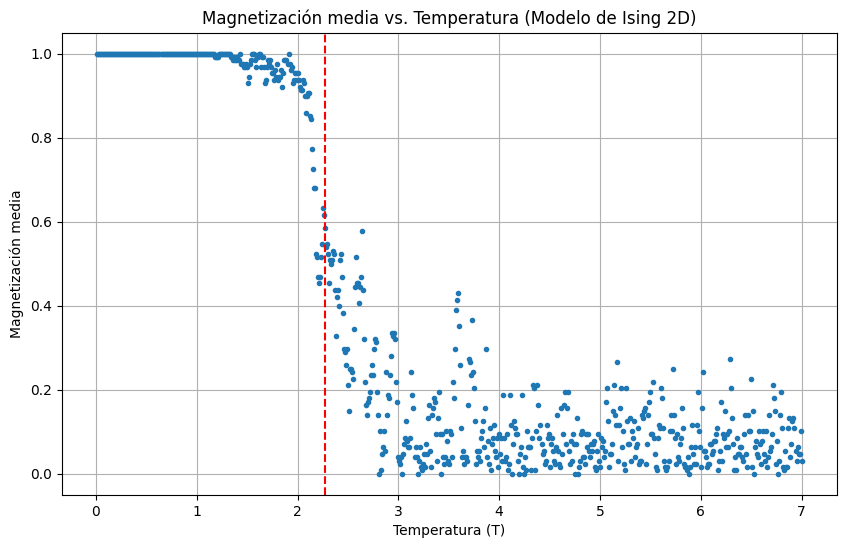

# Red de Hopfield

Las redes de Hopfield son un tipo de red neuronal recurrente, conocidas por su capacidad para actuar como **memorias asociativas**. A través de estas redes, es posible recuperar patrones previamente aprendidos, incluso cuando se presentan versiones incompletas o con ruido.

El funcionamiento de una red de Hopfield se basa en la energía de los estados del sistema. El objetivo es que la red evolucione hacia un estado de **mínima energía**, lo que permite que se recupere el patrón más cercano al que se le presentó. La regla de actualización sigue un criterio de minimizar la energía global del sistema.

## Alteración de imágenes y ruido

En este experimento, se entrenó una red de Hopfield con imágenes binarias y luego se evaluó su capacidad para recordar dichas imágenes cuando se presentaban versiones alteradas. La alteración de las imágenes se realizó de varias maneras:

1. **Ruido**: Se invirtieron los valores de píxeles aleatorios en un porcentaje del 30%.
   
3. **Borrado de elementos**: Se pusieron en blanco (1) píxeles aleatorios, también con un porcentaje del 30%.
   
5. **Agregado de elementos**: Se añadieron elementos oscuros (-1) en las imágenes, con un porcentaje del 40%.
   

A pesar de estas alteraciones, la red de Hopfield fue capaz de **recuperar correctamente los patrones en la mayoría de los casos**.

  
Estados Espurios

  Una de las características de las redes de Hopfield es la aparición de **estados espurios**. Estos son estados estables en los que la red puede caer, pero que no corresponden a ninguno de los patrones aprendidos. Pueden ser patrones inversos o combinaciones de varios patrones aprendidos, lo que provoca que la red no siempre converja al patrón correcto.

  Los estados espurios pueden ser:
  - **Patrones inversos**: El patrón original con los signos de todos los elementos invertidos.
  - **Combinaciones de patrones**: Una superposición de varios patrones aprendidos.

  
  
  **Figura 2.2**: Ejemplos de un patrones espurios generados al combinar tres patrones aprendidos.

  
Capacidad de la red

  La capacidad de una red de Hopfield se refiere a cuántos patrones puede almacenar y recordar de forma efectiva. Durante los experimentos, se comprobó cómo esta capacidad cambia por factores como la correlación entre los patrones o cuando se eliminan sinapsis al azar. A medida que se eliminan sinapsis, la capacidad disminuye, ya que la red pierde información crucial sobre las conexiones que permiten recuperar los patrones almacenados.

  En el caso de las sinápisis eliminadas, el error se modifica, pero aún en grandes porcentajes de conexiones eliminadas, la red continúa con poco error:

  

  Además, la capacidad se ve modificada de la siguiente manera:
  
  

  
Modelo de Ising

  El **Modelo de Ising** es un modelo de la física estadística que fue propuesto para explicar los fenómenos de magnetización en materiales ferromagnéticos. En el contexto de redes neuronales, es relevante para entender cómo los sistemas de muchas unidades pueden mostrar **comportamiento colectivo**.

  ### ¿Por qué surge el Modelo de Ising?

  Este modelo surge para estudiar la interacción entre átomos con **spines** (o momentos magnéticos) que solo pueden tener dos estados posibles: **arriba (+1)** o **abajo (-1)**. Cada átomo está influenciado por sus vecinos, y el sistema busca configuraciones que minimicen la energía total del conjunto, similar a cómo las redes de Hopfield intentan converger a un estado de mínima energía.

  La **energía del sistema** se calcula considerando las interacciones entre pares de espines vecinos. Si dos espines están alineados (ambos +1 o ambos -1), contribuyen a bajar la energía del sistema. Si están en direcciones opuestas, la energía del sistema aumenta.

  ### Magnetización y la importancia del modelo

  La **magnetización** mide cuántos espines están alineados en la misma dirección. En materiales ferromagnéticos, por debajo de una cierta temperatura llamada **temperatura crítica** o **temperatura de Curie**, los espines tienden a alinearse, produciendo magnetización neta. Por encima de esta temperatura, el sistema pierde la alineación y, en promedio, no hay magnetización.

  En una dimensión (1D), no hay magnetización espontánea a temperatura finita. Esto se debe a que, en el modelo 1D, las fluctuaciones térmicas son lo suficientemente fuertes como para desordenar los espines, incluso a temperaturas bajas, lo que impide que se forme una magnetización neta. Esto contrasta con sistemas en dos o más dimensiones, donde existe una transición de fase que permite una magnetización neta por debajo de la temperatura crítica.

  
  
  **Figura 3.1**: Magnetización en función de la temperatura en el Modelo de Ising.

  ### Importancia del modelo

  El **Modelo de Ising** es crucial para entender **transiciones de fase**, como el cambio entre un estado magnético y no magnético en los materiales. Estos conceptos son aplicables también a redes neuronales recurrentes, donde se observa que los estados de baja energía son los equivalentes a patrones memorizados. Al igual que el modelo de Ising, las redes neuronales deben equilibrar la energía y las interacciones entre nodos.

## Conclusiones

La red de Hopfield es eficaz para recuperar patrones con cierto nivel de ruido o alteración, pero sufre de la aparición de estados espurios que pueden comprometer la recuperación correcta. Además, la capacidad de almacenamiento depende en gran medida de la integridad de las conexiones sinápticas, y la eliminación de sinapsis afecta negativamente su rendimiento.

---

Este desarrollo y más puede encontrarse en el archivo [`hopfieldNetwork.ipynb`](../hopfieldNetwork.ipynb), donde con otros ejemplos prácticos también se analiza:
- Cómo la red responde a patrones no aprendidos.
- La influencia de la cantidad de patrones almacenados en la capacidad de la red.
- Simmulated Annealing.
